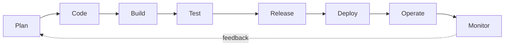

# DevOps Foundations

> **Module 0 of the DevOps Masterclass.** Start here. This is the *"why"* before all the *"how"*.

Before you touch a single tool, you need to understand what DevOps actually is, why it exists, and how every tool in this course fits into one bigger picture. Two short lessons give you that foundation.

## What problem does this module solve?

People often jump straight into Docker or Kubernetes and end up as copy-paste engineers who cannot debug because they never learned *what the tools are for*. This module fixes that: it teaches **how software is built (the SDLC) first**, then **how DevOps improves that process**, so every later tool has a place to live in your mental model.

## Interactive demos

Open these live online in any browser (no download):
- [DevOps Lifecycle](https://siva9800.github.io/devops-animations/devops/devops-lifecycle.html) - watch the continuous loop come alive.
- [Waterfall vs Agile](https://siva9800.github.io/devops-animations/devops/sdlc-models.html) - compare the two delivery models side by side.

## Lessons

| Day | Topic | What you will learn |
|---|---|---|
| [Day 1](day1-sdlc/notes.md) | **Software Development Life Cycle** | How software is built: all SDLC stages and models (Waterfall, Agile, Spiral, V-Model) |
| [Day 2](day2-what-is-devops/notes.md) | **What is DevOps?** | Culture, why it exists, CALMS, the toolchain, and how it improves the SDLC |

## Learning outcomes

By the end of this module you will be able to:
- Explain DevOps to a non-technical person in one sentence.
- Name the stages of the software lifecycle and what each produces.
- Describe the CALMS principles and why small frequent releases are safer.
- Map every tool in this course to the lifecycle stage it serves.

## How to use this module

Read Day 1, then Day 2, in order. Day 1 teaches how software is built; Day 2 shows how DevOps improves it. Open the animations when a concept feels abstract. There is nothing to install yet - this module is about understanding, not tooling.

Start with [Day 1 - The Software Development Life Cycle](day1-sdlc/notes.md). When you finish, move on to the [Git module](../learn-git).
