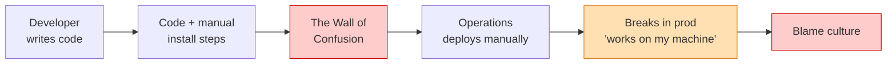
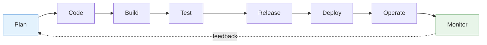
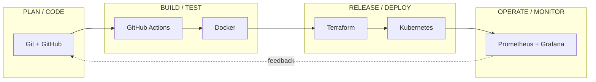
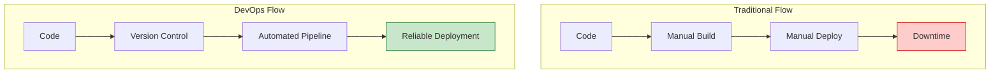
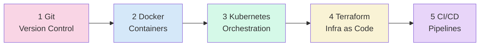

# DevOps Fundamentals - Introduction

> **Module 1 of the DevOps Masterclass.** Start here. This is the *"why"* before all the *"how"*.

Before learning any DevOps tools (Git, Docker, Kubernetes, Terraform, CI/CD), it is important to understand **what DevOps is, why it exists, and how it works in real companies**.

This document explains DevOps **from first principles**, not from tools.

> **Interactive demo:** open [`animations/devops-lifecycle.html`](animations/devops-lifecycle.html) in any browser to watch the DevOps lifecycle loop come alive.

---

## Objective

By the end of this session, trainees will understand:
- What DevOps really means.
- Why DevOps was needed.
- Problems with traditional software delivery.
- How DevOps improves the SDLC.
- What DevOps engineers actually do.
- How tools fit into the DevOps lifecycle.

---

## 1 What is DevOps?

**DevOps = Development + Operations**

DevOps is a **set of practices, culture, and automation** that helps teams:
- Build software faster.
- Deploy more frequently.
- Reduce failures.
- Improve collaboration between teams.

> [!IMPORTANT]
> **DevOps is NOT:**
> - A single tool
> - Just CI/CD
> - Only automation scripts
> - A job title you buy with one certificate
>
> **DevOps IS:**
> - A culture of collaboration
> - Automation of repetitive work
> - Faster and safer software delivery
> - Shared ownership of the product, from code to production

### A one-line definition you can remember

> *"DevOps is the practice of shrinking the distance - and the time - between a developer writing code and a user safely benefiting from it."*

---

## 2 Why DevOps Was Needed (The Problem)

### Traditional Model (Before DevOps)

In the legacy model, developers and operations teams were **"siloed"** - they worked in separate walls, with separate goals.

- **Developers** are rewarded for *change* (ship new features).
- **Operations** are rewarded for *stability* (don't let anything break).

These two goals pull in opposite directions. That tension is the root cause of most pre-DevOps pain.

### Problems with This Model
- Manual server setup and deployments lead to slow and error-prone work.
- Slow release cycles (months between releases).
- **Environment Mismatch:** the *"it works on my machine"* problem.
- Low visibility - no one owns the full picture.
- High failure rate and a **"blame culture."**

---

## 3 Software Development Life Cycle (SDLC)

Every application follows this cycle:

### Stage Breakdown
- **Plan & Code:** Requirements, design, and writing the source.
- **Build & Test:** Packaging the app and detecting bugs early.
- **Release & Deploy:** Preparing and pushing software to production.
- **Operate & Monitor:** Keeping the app running and observing performance.

> **Deep dive:** the full SDLC guide - every stage, every model (Waterfall, Agile, Spiral, V-Model) - lives in [`sdlc/readme.md`](sdlc/readme.md).

---

## 4 How DevOps Improves SDLC

DevOps introduces **automation** and **continuous feedback** at every stage.

| | Traditional | DevOps |
|---|---|---|
| **Release size** | Big, risky "big bang" | Small, frequent |
| **Feedback** | Late (after release) | Continuous |
| **Failure impact** | Large blast radius | Small, easy to roll back |
| **Recovery** | Slow (hours/days) | Fast (minutes) |

> **Key insight:** Small releases → faster feedback → higher stability. Counter-intuitively, **shipping *more often* makes software *safer*, not riskier**, because each change is tiny and easy to reverse.

---

## 5 Core Principles of DevOps (CALMS)

The industry remembers DevOps culture with the acronym **CALMS**:

| Letter | Principle | Meaning |
|:---:|---|---|
| **C** | **Culture** | Shared responsibility between Dev and Ops - "you build it, you run it." |
| **A** | **Automation** | Remove manual steps to reduce human error and toil. |
| **L** | **Lean** | Deliver in small batches; eliminate waste and waiting. |
| **M** | **Measurement** | You can't improve what you don't measure (metrics, logs, traces). |
| **S** | **Sharing** | Open knowledge, tools, and feedback across teams. |

Two more foundational ideas you will use constantly:
- **Infrastructure as Code (IaC):** Manage servers and networks like software - version-controlled, reviewable, repeatable.
- **Observability:** Use logs, metrics, and traces for fast issue detection.

---

## 6 DevOps Toolchain (High-Level Overview)

You don't learn tools randomly - each tool solves a **specific stage** of the lifecycle. This is the map for the rest of this course:

| Area | Purpose | Examples | This Course |
|:--- |:--- |:--- |:---|
| **Version Control** | Track code changes | Git, GitHub | `learn-git` |
| **Containers** | Package applications | Docker | `learn-docker` |
| **Orchestration** | Run containers at scale | Kubernetes | `learn-k8s` |
| **IaC** | Automate infrastructure | Terraform, Ansible | `learn-terraform` |
| **CI/CD** | Automate build & deployment | GitHub Actions, Jenkins | `learn-cicd` |
| **Monitoring** | Observe system health | Prometheus, Grafana | *(applied throughout)* |

---

## 7 Traditional vs. DevOps Flow

---

## 8 Real-World DevOps Flow (Simplified)

1. Developer pushes code to **Version Control** (Git/GitHub).
2. The change triggers an **Automated Pipeline** (CI/CD).
3. The application is **Built and Tested** automatically.
4. The app is **packaged** into a container image (Docker).
5. **Infrastructure is provisioned** as code (Terraform).
6. The container is **deployed and scaled** (Kubernetes).
7. The system is **Monitored** for health (Prometheus/Grafana).
8. **Feedback** from monitoring informs the next change.

> This exact flow is what you will build, piece by piece, across the rest of this course.

---

## 9 Role of a DevOps Engineer

A DevOps engineer is an **enabler**, not a gatekeeper. Their goal is to:
- Automate infrastructure and deployments.
- Improve system reliability and uptime.
- Reduce manual **"toil."**
- Improve **developer productivity** (make the right way the easy way).
- Build **guardrails**, not gates - let teams move fast *safely*.

> **Common misconception:** "DevOps engineer" is not just "the person who runs the pipeline." The best ones build *platforms and culture* so that every developer can ship safely without asking permission.

---

## What You Will Learn After This

With the foundation set, the roadmap ahead:

| # | Topic | Folder | What it gives you |
|:-:|---|---|---|
| 1 | **Version Control** | `learn-git` | Track, branch, and collaborate on code |
| 2 | **Application Packaging** | `learn-docker` | "Build once, run anywhere" containers |
| 3 | **Container Orchestration** | `learn-k8s` | Run containers reliably at scale |
| 4 | **Infrastructure Automation** | `learn-terraform` | Create cloud infra with code |
| 5 | **End-to-End Pipelines** | `learn-cicd` | Tie it all together automatically |

---

## Key Takeaway

> *"DevOps is about **how** we build and deliver software, not just the tools we use."*

The tools change every few years. The **principles** - collaboration, automation, small batches, fast feedback - do not. Learn the principles deeply, and every new tool becomes easy.

---

## Quick Self-Check

Before moving on, make sure you can answer these out loud:
1. What two words make up "DevOps," and why were they in conflict before?
2. Name the 8 stages of the SDLC in order.
3. What does CALMS stand for?
4. Why does releasing *more often* make software *safer*?
5. Which tool in the course solves which lifecycle stage?

---

**With this foundation, you are ready to start learning DevOps tools confidently.**
Next stop → [`sdlc/readme.md`](sdlc/readme.md) for the full Software Development Life Cycle deep dive.
