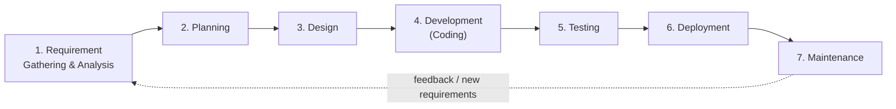
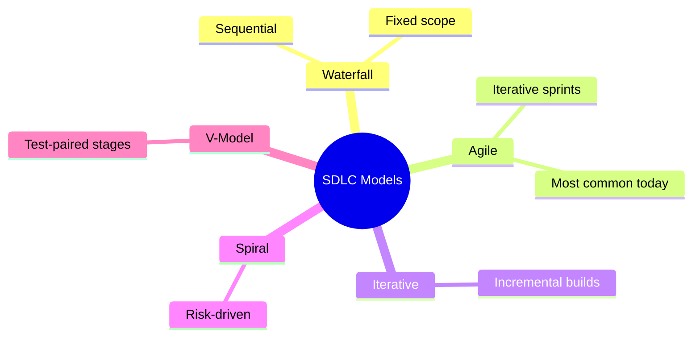
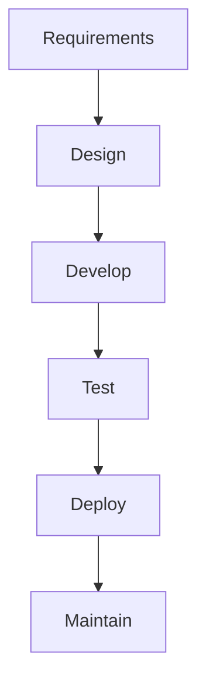
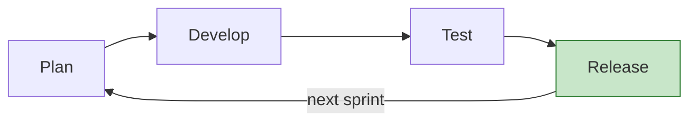
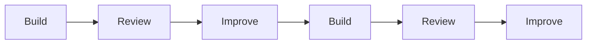
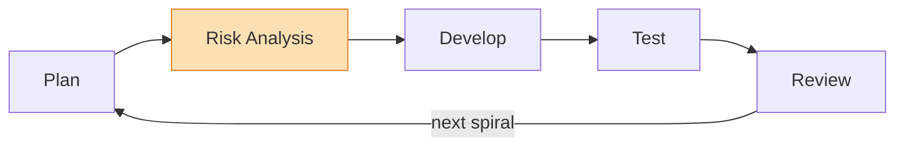
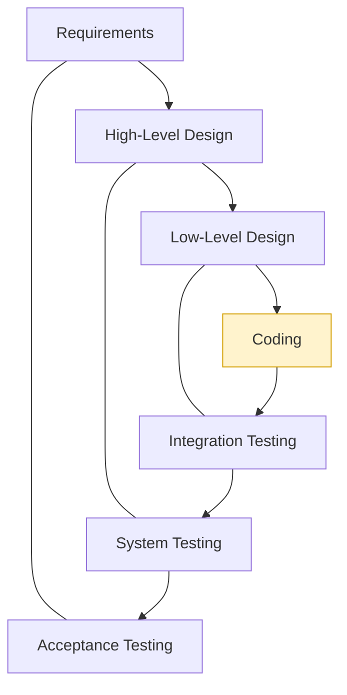

# Day 1 - The Software Development Life Cycle (SDLC)

> **Goal of today:** understand how software is actually built, start to finish, and the different "models" teams use to build it (Waterfall, Agile, Spiral, V-Model). This is the foundation - tomorrow you will see how DevOps improves all of it.

Before you can understand *DevOps*, you need to understand the thing DevOps improves: the process of building software. That process has a name - the **Software Development Life Cycle (SDLC)** - and every application you have ever used was built through some version of it.

> **Interactive demo:** open the [Waterfall vs Agile animation](https://siva9800.github.io/devops-animations/devops/sdlc-models.html) to watch the two main delivery models run side by side.

---

## Learning Objectives

By the end of this lesson you will be able to:
- Explain what SDLC is and why every team needs one.
- Name the stages of the SDLC and what each one produces.
- Compare the major SDLC models (Waterfall, Agile, Iterative, Spiral, V-Model).
- Say which model fits which kind of project, and why.
- Recognise the pain points in traditional SDLC that set the stage for DevOps.

---

## A real-world analogy: building a house

You do not build a house by randomly buying bricks and starting to stack them. There is a sequence: you **plan** what you want, an architect **designs** blueprints, builders **construct** it, an inspector **checks** it, you **move in**, and then you **maintain** it for years.

Software is built the same way. The **SDLC is the blueprint-to-handover process for software** - a structured set of stages that takes an idea and turns it into a running, maintained product. And just as there are different ways to manage a construction project (build it all at once from a fixed plan, or build room by room adjusting as you go), there are different **SDLC models**.

---

## 1 What is SDLC?

**SDLC (Software Development Life Cycle)** is a structured process for planning, designing, developing, testing, deploying, and maintaining software.

It exists to give software work **discipline, predictability, and quality**. Without a defined process, teams build the wrong thing, discover bugs far too late, and ship software that breaks in front of users.

---

## 2 Why SDLC is Needed

| Without a defined SDLC | With a defined SDLC |
|---|---|
| Unclear or changing requirements | A clear, agreed workflow |
| Poor or accidental design | Defined responsibilities at each stage |
| Bugs found late (expensive to fix) | Problems caught early (cheap to fix) |
| Surprise, failed deployments | Predictable, repeatable releases |
| Constant production fires | Easier long-term maintenance |

> **Key idea:** a bug caught while *planning* costs almost nothing to fix. The same bug caught in *production* can cost hundreds of times more. A good SDLC pushes problem-detection as early as possible.

---

## 3 The 7 Stages of the SDLC

The classic SDLC has **7 stages**, flowing from an idea to a running, maintained product. This is the standard model you should know for interviews.

Each stage takes an **input** and produces an **output** that the next stage needs:

| # | Stage | Purpose | Input | Output |
|:-:|---|---|---|---|
| 1 | **Requirement Gathering & Analysis** | Understand *what* the business and customers need | Business idea, customer needs | Requirements specification |
| 2 | **Planning** | Decide cost, resources, timeline, and risks | Requirements | Project plan and schedule |
| 3 | **Design** | Decide *how* to build it | Requirements + plan | Architecture, database, APIs, UI/UX (HLD + LLD) |
| 4 | **Development (Coding)** | Write the application code | Design documents | Source code (with reviews and unit tests) |
| 5 | **Testing** | Verify it works and fix bugs | Code + test cases | Tested, verified build |
| 6 | **Deployment** | Release to production for end users | Verified build | Running application in production |
| 7 | **Maintenance** | Keep it running and improving | Live application | Bug fixes, performance gains, new features |

> **HLD vs LLD:** in the Design stage, the **High-Level Design (HLD)** describes the overall architecture (the big picture - which systems, databases, and services), while the **Low-Level Design (LLD)** details each component (the inner workings - specific modules, classes, and logic).

> Notice the loop back from **Maintenance** to **Requirement Gathering**: software is never truly "finished." Real usage produces new requirements, and the cycle begins again. Hold onto this loop - tomorrow you will see how DevOps turns it into a fast, automated, continuous cycle.

---

## 4 SDLC Models - the same stages, run differently

The stages above are *what* happens. An **SDLC model** decides *how* those stages are sequenced and repeated. Different projects need different models.

The next sections walk through each one.

---

## 5 Waterfall Model

Waterfall is **sequential**: each phase must fully finish before the next begins, like water flowing down a series of steps and never back up.

| Characteristics | Advantages | Disadvantages |
|---|---|---|
| One phase at a time | Simple to understand | Very slow to deliver |
| No easy way back | Clear milestones | No flexibility once started |
| Heavy upfront documentation | Good for fixed requirements | Testing happens late, so bugs surface late |
| Changes are costly | Easy to manage and audit | High risk - you only see the result at the very end |

**Where it is used:** government projects, legacy systems, and fixed-scope contracts where requirements genuinely will not change.

> Waterfall's core weakness - you do not get *anything* working until the very end, and change is painful - is exactly what the Agile and DevOps movements were created to solve.

---

## 6 Agile Model

Agile uses **short, repeating cycles called sprints** (usually 1-4 weeks). Each sprint delivers a small but *working* slice of the product, then you get feedback and do it again.

| Characteristics | Advantages | Disadvantages |
|---|---|---|
| Short development cycles | Adapts easily to change | Requires team discipline |
| Continuous customer feedback | Feedback comes fast | Lighter documentation |
| Frequent small releases | Lower risk per release | Needs experienced people |
| High collaboration | Higher customer satisfaction | Scope can drift without care |

**Where it is used:** most modern companies, startups, and cloud-native applications.

> **Agile + DevOps is the dominant modern approach.** Agile changed *how teams plan and build* (small iterations); DevOps extends that same idea to *how teams test, release, and operate* (automation and fast feedback). They fit together naturally - which is why this course teaches DevOps right after this lesson.

---

## 7 Iterative Model

Software is built **incrementally**: an early, basic version is built first, then each cycle adds and refines features.

| Advantages | Disadvantages |
|---|---|
| Working software early | Needs good upfront planning |
| Risk is reduced over time | Scope can creep |
| Continuous improvement | Architecture may need reworking later |

**Where it is used:** large systems and applications whose requirements are expected to evolve.

> Agile is essentially a disciplined, fast form of iterative development with fixed-length cycles and heavy customer involvement.

---

## 8 Spiral Model

The Spiral model puts **risk analysis** at the centre of every cycle. It combines Waterfall's rigor with iterative loops, and at each loop you explicitly ask "what could go wrong, and how do we reduce that risk?"

| Advantages | Disadvantages |
|---|---|
| Excellent for high-risk projects | Complex to manage |
| Risks are found early | Expensive |
| Strong planning discipline | Overkill for small projects |

**Where it is used:** banking systems, defence, and critical enterprise applications where failure is very costly.

---

## 9 V-Model (Verification and Validation)

The V-Model pairs **every build stage with a matching test stage**, planned *up front*. Reading the V: the left side builds (requirements down to code), the right side verifies (unit tests up to acceptance tests).

| Advantages | Disadvantages |
|---|---|
| High quality, testing planned early | Rigid, like Waterfall |
| Each stage has a clear test | Hard to change requirements midway |
| Strong validation focus | Not iterative |

**Where it is used:** medical, automotive, and other safety-critical software where every requirement must be provably tested.

---

## 10 Traditional vs Modern SDLC

| Aspect | Traditional (Waterfall-style) | Modern (Agile + DevOps) |
|---|---|---|
| Flexibility | Low | High |
| Automation | Low | High |
| Feedback | Late | Continuous |
| Release frequency | Rare | Frequent |
| Risk per release | High | Low |

This contrast is the bridge to tomorrow. The "modern" column does not happen by magic - it is achieved through **DevOps**, which is exactly what Day 2 covers.

---

## Common Mistakes

1. **Thinking SDLC and DevOps are the same thing.** SDLC is *the process of building software*. DevOps is *a way of improving and automating that process*. DevOps does not replace SDLC - it supercharges it.
2. **Believing one model is "best."** There is no universally best model. Waterfall suits fixed-scope safety-critical work; Agile suits fast-changing products. The skill is matching the model to the project.
3. **Treating testing as a final stage only.** In modern SDLC, testing happens *throughout* (the V-Model and Agile both push testing early). Testing only at the end is how bugs reach users.
4. **Ignoring the feedback loop.** The monitoring-to-planning loop is not optional decoration - it is how good software keeps improving. Skipping it means you never learn from real usage.

---

## Quick Self-Check

1. In one sentence, what is the SDLC, and what real-world process is it like?
2. List the SDLC stages in order, and name the output of any three of them.
3. Why does a bug cost more the later it is found?
4. What is the core weakness of Waterfall that Agile solves?
5. In the V-Model, which testing stage pairs with "Requirements"?
6. What does the feedback loop (maintenance back to requirements) achieve?

---

## Summary

- The **SDLC** is the structured process of building software, stage by stage, from idea to maintenance.
- The 7 stages (requirement analysis, planning, design, development, testing, deployment, maintenance) each take an input and hand an output to the next - and the whole thing loops when maintenance surfaces new requirements.
- **SDLC models** run those stages differently: Waterfall (sequential), Agile (iterative sprints, the modern default), Iterative, Spiral (risk-driven), and V-Model (test-paired).
- Traditional models are slow and inflexible; the modern Agile + DevOps approach is fast, automated, and feedback-driven.
- You now understand *how software is built*. Tomorrow you learn *how DevOps makes that process dramatically better*.

**Next up ->** [Day 2 - What is DevOps?](../day2-what-is-devops/notes.md)
