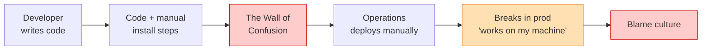
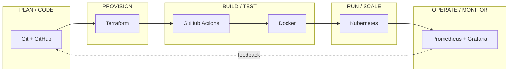
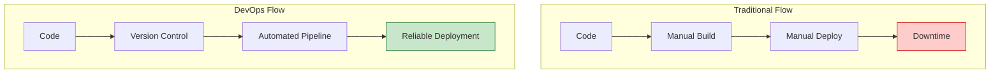
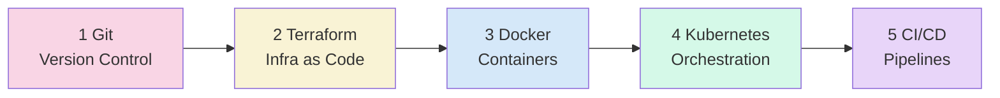

# Day 2 - What is DevOps?

> **Goal of today:** now that you know *how software is built* (the SDLC), learn how **DevOps** makes that process faster, safer, and more collaborative - and how every tool in this course fits into it.

Yesterday you learned the Software Development Life Cycle - the stages every team uses to turn an idea into running software, and the models (Waterfall, Agile, and so on) for running those stages. You also saw the gap: traditional approaches are slow, manual, and risky. **DevOps is how modern teams close that gap.** This lesson explains DevOps from first principles, not from tools.

> **Interactive demo:** open the [DevOps Lifecycle animation](https://siva9800.github.io/devops-animations/devops/devops-lifecycle.html) in any browser to watch the continuous loop come alive.

---

## Learning Objectives

By the end of this lesson you will be able to:
- Explain what DevOps really means (and what it is not).
- Describe the traditional problem DevOps was created to solve.
- Connect DevOps back to the SDLC you learned in Day 1.
- State the core DevOps principles (CALMS).
- Map every tool in this course to a stage of the lifecycle.
- Describe what a DevOps engineer actually does.

---

## A real-world analogy: the restaurant kitchen

Imagine a restaurant where the **chefs** (who invent dishes) and the **waiters** (who serve them) refuse to talk to each other. Chefs cook whatever they like and shove plates through a hatch; waiters deal with whatever arrives and take the blame when customers complain. Orders are slow, dishes arrive wrong, and everyone points fingers across the hatch.

Now imagine the opposite: one team where chefs and waiters share the same goal - a happy customer - communicate constantly, and use a smooth conveyor system so a dish goes from kitchen to table quickly and correctly, every single time.

That second kitchen is **DevOps**. The "hatch" between developers (who build software) and operations (who run it) is torn down, replaced by shared ownership and automation, so software gets to users quickly and reliably.

---

## 1 What is DevOps?

**DevOps = Development + Operations**

DevOps is a combination of **culture, practices, and automation** that helps teams:
- Build software faster.
- Deploy more frequently.
- Reduce failures.
- Collaborate instead of blaming.

> [!IMPORTANT]
> **DevOps is NOT:**
> - A single tool
> - Just CI/CD
> - Only automation scripts
> - A job title you buy with one certificate
>
> **DevOps IS:**
> - A culture of collaboration
> - Automation of repetitive work
> - Faster and safer software delivery
> - Shared ownership of the product, from code to production

### A one-line definition worth remembering

> *"DevOps is the practice of shrinking the distance - and the time - between a developer writing code and a user safely benefiting from it."*

---

## 2 Why DevOps Was Needed (The Problem)

Recall from Day 1 that traditional SDLC models are slow, manual, and risky. The deeper reason is organisational: developers and operations teams were **siloed** - separated by a wall, with opposing goals.

- **Developers** are rewarded for *change* - shipping new features.
- **Operations** are rewarded for *stability* - keeping everything from breaking.

Those two goals pull in opposite directions. That tension - often called the **"wall of confusion"** - is the root cause of most pre-DevOps pain.

### The symptoms this caused
- Manual server setup and deployments - slow and error-prone.
- Slow release cycles - sometimes months between releases.
- The **"it works on my machine"** problem (environment mismatch).
- Low visibility - no single person owns the full picture.
- High failure rates and a culture of blame.

---

## 3 How DevOps Fits the SDLC You Already Know

DevOps does not replace the SDLC from Day 1 - it **automates the stages and tightens the feedback loop.** Compare the two columns and you will see DevOps is the engine behind the "modern" SDLC you met yesterday:

| | Traditional SDLC | SDLC with DevOps |
|---|---|---|
| **Release size** | Big, risky "big bang" | Small, frequent |
| **Feedback** | Late (after release) | Continuous |
| **Failure impact** | Large blast radius | Small, easy to roll back |
| **Recovery** | Slow (hours or days) | Fast (minutes) |

> **Key insight:** small releases lead to faster feedback and *higher* stability. It feels backwards, but **shipping more often makes software safer, not riskier** - each change is tiny, easy to test, and easy to reverse. This is the single most important idea in DevOps.

---

## 4 Core Principles of DevOps (CALMS)

The industry sums up DevOps culture with the acronym **CALMS**:

| Letter | Principle | Meaning |
|:---:|---|---|
| **C** | **Culture** | Shared responsibility between Dev and Ops - "you build it, you run it." |
| **A** | **Automation** | Remove manual steps to reduce human error and toil. |
| **L** | **Lean** | Deliver in small batches; eliminate waste and waiting. |
| **M** | **Measurement** | You cannot improve what you do not measure (metrics, logs, traces). |
| **S** | **Sharing** | Open knowledge, tools, and feedback across teams. |

Two foundational ideas you will use constantly throughout the course:
- **Infrastructure as Code (IaC):** manage servers and networks like software - version-controlled, reviewable, repeatable. (This is the Terraform module.)
- **Observability:** use logs, metrics, and traces to detect and diagnose issues fast. (This runs throughout, especially Kubernetes monitoring.)

---

## 5 The DevOps Toolchain (and your course map)

You do not learn tools randomly - **each tool solves a specific stage of the lifecycle.** This table is the map for the rest of the course:

| Area | Purpose | Examples | This Course |
|:--- |:--- |:--- |:---|
| **Version Control** | Track code changes | Git, GitHub | `learn-git` |
| **Infrastructure as Code** | Automate infrastructure | Terraform, Ansible | `learn-terraform` |
| **Containers** | Package applications | Docker | `learn-docker` |
| **Orchestration** | Run containers at scale | Kubernetes | `learn-k8s` |
| **CI/CD** | Automate build and deployment | GitHub Actions, Jenkins | `learn-cicd` |
| **Monitoring** | Observe system health | Prometheus, Grafana | *(applied throughout)* |

---

## 6 Traditional vs DevOps Flow

---

## 7 A Real-World DevOps Flow (Simplified)

Here is what a single code change looks like in a DevOps team. This is the exact flow you will build, piece by piece, across the rest of this course:

1. A developer pushes code to **version control** (Git/GitHub).
2. The change automatically triggers a **pipeline** (CI/CD).
3. The application is **built and tested** automatically.
4. The app is **packaged** into a container image (Docker).
5. **Infrastructure is provisioned** as code (Terraform).
6. The container is **deployed and scaled** (Kubernetes).
7. The running system is **monitored** for health (Prometheus/Grafana).
8. **Feedback** from monitoring informs the next change - and the loop repeats.

> Notice this is the same loop from your Day 1 SDLC diagram - just fully automated.

---

## 8 Role of a DevOps Engineer

A DevOps engineer is an **enabler**, not a gatekeeper. Their job is to:
- Automate infrastructure and deployments.
- Improve system reliability and uptime.
- Reduce manual **"toil"** (repetitive manual work).
- Improve **developer productivity** - make the right way the easy way.
- Build **guardrails, not gates** - let teams move fast *safely*.

> **Common misconception:** a DevOps engineer is not just "the person who runs the pipeline." The best ones build *platforms and culture* so that every developer can ship safely without asking permission.

---

## 9 What You Will Learn Next

With the foundation set, here is the road ahead:

| # | Topic | Folder | What it gives you |
|:-:|---|---|---|
| 1 | **Version Control** | `learn-git` | Track, branch, and collaborate on code |
| 2 | **Infrastructure Automation** | `learn-terraform` | Create cloud infrastructure with code |
| 3 | **Application Packaging** | `learn-docker` | "Build once, run anywhere" containers |
| 4 | **Container Orchestration** | `learn-k8s` | Run containers reliably at scale |
| 5 | **End-to-End Pipelines** | `learn-cicd` | Tie it all together automatically |

---

## Common Mistakes

1. **Thinking DevOps is a tool you install.** It is a culture and a set of practices first; tools only support it.
2. **Believing DevOps is only the pipeline.** The pipeline is one piece - collaboration, monitoring, and shared ownership matter just as much.
3. **Assuming more releases means more risk.** The opposite is true: small, frequent releases are safer than rare, large ones.
4. **Confusing DevOps with the SDLC.** The SDLC is *the process of building software*; DevOps is *how you make that process fast and reliable*. They work together.

---

## Quick Self-Check

Make sure you can answer these out loud:
1. What two words make up "DevOps," and why were the two groups in conflict?
2. What is the "wall of confusion," and what causes it?
3. What does CALMS stand for?
4. Why does releasing *more often* make software *safer*?
5. Which tool in this course solves which lifecycle stage? (Name at least three.)

---

## Summary

- **DevOps = Development + Operations:** a culture of collaboration plus automation that improves the SDLC you learned in Day 1.
- It exists to tear down the "wall of confusion" between teams who build software and teams who run it.
- **CALMS** captures its principles: Culture, Automation, Lean, Measurement, Sharing.
- Every tool in this course maps to a stage of the software lifecycle - you now have the map.

> *"DevOps is about **how** we build and deliver software, not just the tools we use."* The tools change every few years; the principles do not.

**Previous:** [Day 1 - The Software Development Life Cycle](../day1-sdlc/notes.md)
**Next module ->** [learn-git](../../learn-git) to start with version control.
