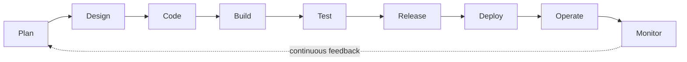
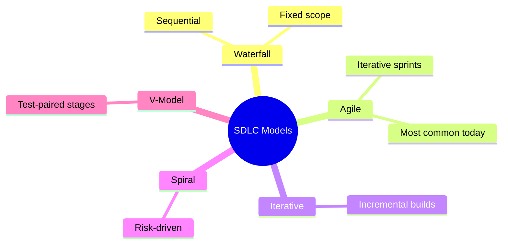
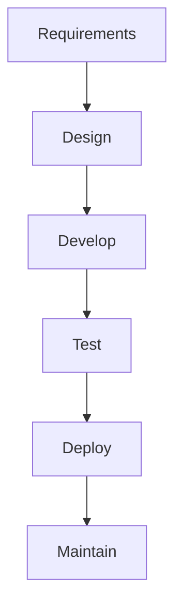
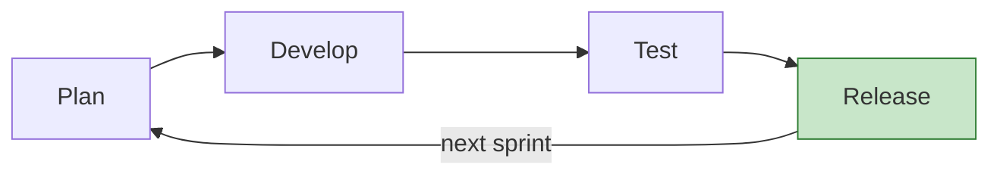
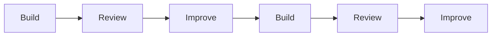
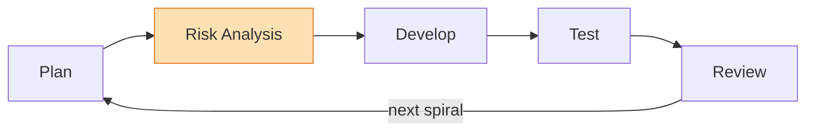
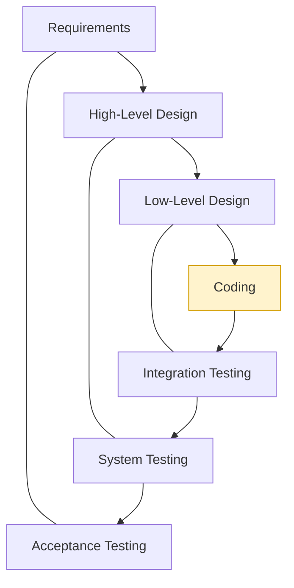
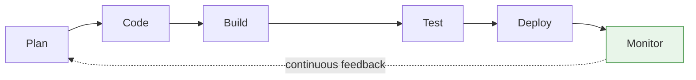
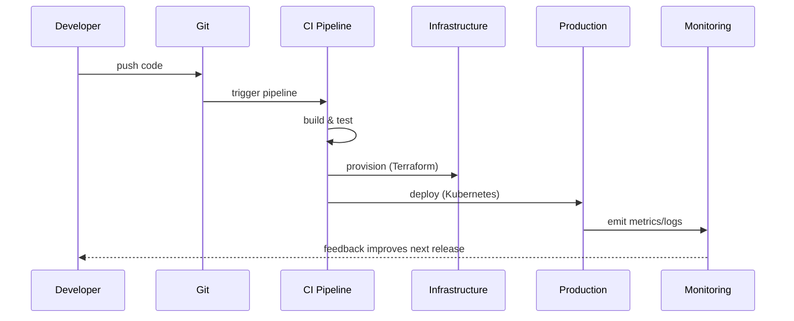

# Software Development Life Cycle (SDLC) - Complete Guide

The **Software Development Life Cycle (SDLC)** defines **how software is planned, designed, developed, tested, deployed, and maintained**.

Every application - websites, mobile apps, APIs, enterprise systems - follows SDLC in some form.

Understanding SDLC is **mandatory before learning DevOps**, because **DevOps exists to improve and automate SDLC**.

> **Interactive demo:** open [`../animations/sdlc-models.html`](../animations/sdlc-models.html) to compare Waterfall vs Agile side-by-side visually.

---

## Objectives of This Document

By the end of this document, you will understand:

- What SDLC is and why it exists
- All stages of SDLC in detail
- Inputs and outputs of each stage
- Different SDLC models and how they work
- Advantages and disadvantages of each model
- How Agile and DevOps improve SDLC
- How SDLC works in real-world DevOps projects

---

## 1 What is SDLC?

**SDLC (Software Development Life Cycle)** is a **structured process** used to plan, design, develop, test, deploy, and maintain software.

SDLC provides **discipline, predictability, and quality** to software development. Without it, teams build the wrong thing, find bugs too late, and ship unreliable software.

---

## 2 Why SDLC is Needed

| Without SDLC | With SDLC |
|---|---|
| No clear requirements | Clear workflow |
| Poor design | Defined responsibilities |
| Late bug detection | Better quality |
| Failed deployments | Predictable releases |
| High production issues | Easier maintenance |

---

## 3 High-Level SDLC Flow

A modern SDLC looks like this:

Each stage has a **clear purpose and output**.

---

## 4 SDLC Stages (with Inputs & Outputs)

| Stage | Purpose | Input | Output |
|---|---|---|---|
| **Planning** | Decide *what* to build | Business idea, market need | Requirements document, scope |
| **Design** | Decide *how* to build | Requirements | Architecture, diagrams, tech choices |
| **Development** | Write the code | Design docs | Source code |
| **Build** | Package the application | Source code | Build artifact (jar, image, binary) |
| **Testing** | Validate functionality | Artifact + test cases | Test report, verified build |
| **Release** | Prepare for deployment | Verified build | Versioned, approved release |
| **Deployment** | Run in environment | Release | Running application |
| **Operations** | Keep system running | Running app | Uptime, stability |
| **Monitoring** | Observe and improve | Live metrics/logs | Insights → feed next plan |

---

## 5 SDLC Models - Overview

An **SDLC model** defines **how these stages are executed and repeated**. Different projects require different models.

---

## 6 Waterfall Model

Waterfall is a **sequential model** where each phase must finish before the next begins - like water flowing down steps, never back up.

| Characteristics | Advantages | Disadvantages |
|---|---|---|
| One phase at a time | Simple to understand | Very slow |
| No easy going back | Clear milestones | No flexibility |
| Heavy documentation | Good for fixed requirements | Late testing = late bugs |
| Changes are costly | Easy to manage | High risk of total failure |

**Where it's used:** Government projects, legacy systems, fixed-scope contracts.

**Waterfall is NOT suitable for modern DevOps-heavy environments.**

---

## 7 Agile Model

Agile follows **iterative development** using small cycles called **sprints** (typically 1 - 4 weeks). Each sprint delivers a **small working feature**.

| Characteristics | Advantages | Disadvantages |
|---|---|---|
| Short development cycles | Flexible to change | Requires discipline |
| Continuous feedback | Faster feedback | Less documentation |
| Frequent releases | Lower risk per release | Needs experienced teams |
| High collaboration | Better customer satisfaction | Scope can drift |

**Where it's used:** Most modern companies, startups, cloud-native applications.

**Agile + DevOps is the most common modern approach.**

---

## 8 Iterative Model

Software is built **incrementally**, improving with each iteration. Early versions are basic; each cycle adds and refines.

| Advantages | Disadvantages |
|---|---|
| Early delivery | Requires good planning |
| Risk reduction | Can lead to scope creep |
| Continuous improvement | Architecture may need rework |

**Where it's used:** Large systems, applications with evolving requirements.

---

## 9 Spiral Model

The Spiral model focuses on **risk analysis** at every iteration - it combines Waterfall's rigor with iterative cycles.

| Advantages | Disadvantages |
|---|---|
| Excellent for high-risk projects | Complex to manage |
| Early identification of risks | Expensive |
| Strong planning discipline | Overkill for small projects |

**Where it's used:** Banking systems, critical enterprise applications.

---

## V-Model (Verification & Validation)

Each development stage has a **corresponding testing stage** planned *up front* - the left side builds, the right side verifies.

| Advantages | Disadvantages |
|---|---|
| High quality | Rigid |
| Testing planned early | Hard to change requirements |
| Strong validation focus | Not iterative |

---

## 11 Traditional SDLC vs Modern SDLC

| Aspect | Traditional | Modern (Agile + DevOps) |
|---|---|---|
| Flexibility | Low | High |
| Automation | Low | High |
| Feedback | Late | Continuous |
| Releases | Infrequent | Frequent |
| Risk per release | High | Lower |

---

## 12 How DevOps Improves SDLC

DevOps enhances SDLC by automating build/test/deploy and closing the feedback loop:

- Automating build and deployment (CI/CD)
- Enabling Continuous Integration (CI)
- Enabling Continuous Delivery/Deployment (CD)
- Using Infrastructure as Code
- Providing fast feedback via monitoring

---

## 13 SDLC in Real-World DevOps Projects

A practical DevOps SDLC flow:

---

## Key Takeaways

- SDLC defines **how software is built**.
- Different SDLC models suit different projects.
- **Agile is the most common modern SDLC model.**
- **DevOps does NOT replace SDLC - it improves it.**
- Understanding SDLC is critical for DevOps engineers.

---

## Quick Self-Check

1. List the 9 SDLC stages with one input/output each.
2. Why is Waterfall risky for changing requirements?
3. What makes Agile + DevOps the modern default?
4. In the V-Model, which test pairs with "Requirements"?
5. How does DevOps shorten the feedback loop?

---

**Once SDLC is clear, DevOps tools become easy to understand and apply.**
Next module → [`learn-git`](../../learn-git) to start with version control.
